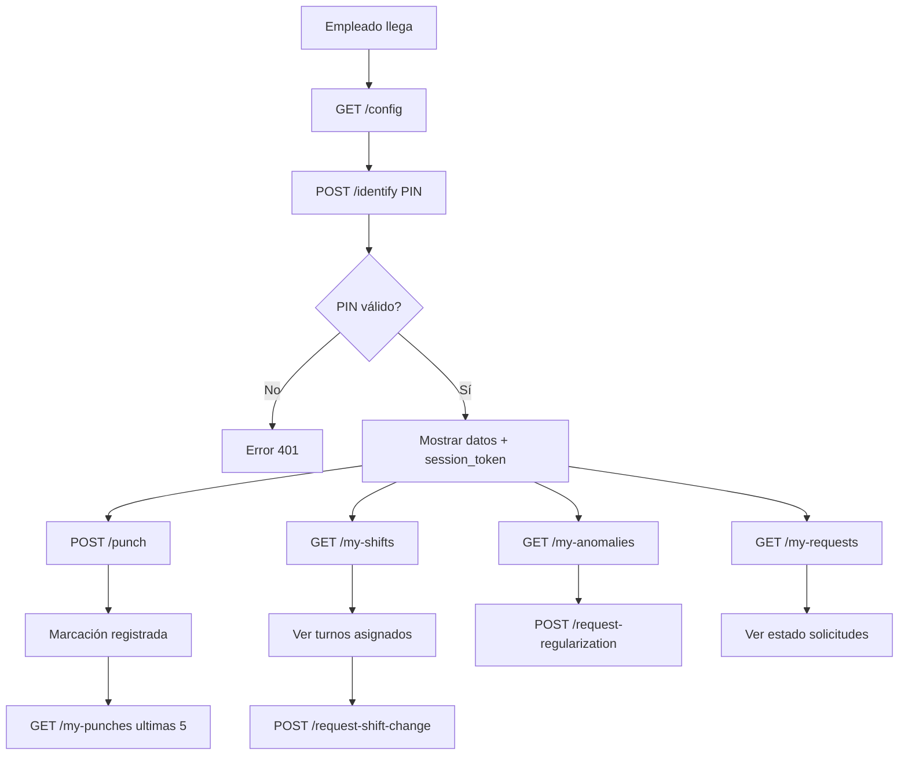

# 📡 CONTRATOS DE ENDPOINTS KIOSK v2.0
## Turnos Titanium Enterprise - API KIOSK

**Fecha:** 2026-01-11  
**Versión:** 2.0 (con correcciones)  
**Base URL:** `/make-server-e19f2094/kiosk`

---

## 🔐 **AUTENTICACIÓN**

Todos los endpoints requieren autenticación mediante:
- **Header:** `Authorization: Bearer <access_token>`
- **Token:** JWT de Supabase auth

---

## 📋 **FORMATO DE RESPUESTA ESTÁNDAR**

**Todos los endpoints** usan este formato:

### **Éxito (2xx):**
```typescript
{
  ok: true,
  data: {
    // ... datos específicos del endpoint
  }
}
```

### **Error (4xx, 5xx):**
```typescript
{
  ok: false,
  error: {
    code: string;        // Código de error (ej: "INVALID_PIN", "THROTTLE_ACTIVE")
    message: string;     // Mensaje legible para el usuario
    details?: any;       // Detalles adicionales (opcional)
  }
}
```

---

## 📡 **ENDPOINTS (13 TOTAL)**

### **1. GET /config**
**Descripción:** Obtener configuración del kiosk (contingencia, botones, throttling)

#### **Request:**
```typescript
// Query params
{
  device_id?: string;  // UUID del dispositivo (opcional)
  company_id?: string; // UUID de la empresa (opcional)
}
```

#### **Response 200:**
```typescript
{
  ok: true,
  data: {
    config: {
      allow_lunch_buttons: boolean;
      allow_permission_buttons: boolean;
      contingency_enabled: boolean;
      contingency_expires_at: string | null; // ISO 8601
      contingency_reason: {
        id: string;
        code: string;
        value: string;
      } | null;
      auto_reset_seconds: number;
      throttle_seconds: number;
    },
    device: {
      id: string;
      name: string;
      code: string;
      location: string;
    } | null
  }
}
```

#### **Response 404:**
```typescript
{
  ok: false,
  error: {
    code: "CONFIG_NOT_FOUND",
    message: "No se encontró configuración para este dispositivo/empresa"
  }
}
```

---

### **2. POST /identify**
**Descripción:** Validar PIN del empleado y retornar información + session token

#### **Request:**
```typescript
{
  pin: string;           // PIN del empleado (4-6 dígitos)
  device_id?: string;    // UUID del dispositivo (opcional)
}
```

#### **Response 200:**
```typescript
{
  ok: true,
  data: {
    employee: {
      id: string;
      code: string;
      full_name: string;
      photo_url: string | null;
      company: {
        id: string;
        name: string;
      };
      current_shift: {
        id: string;
        name: string;
        short_name: string;
        start_time: string; // HH:mm
        end_time: string;   // HH:mm
      } | null;
      last_punch: {
        datetime: string;    // ISO 8601
        type: string;        // IN/OUT/LUNCH_OUT/LUNCH_IN
        source: string;      // BIOMETRIC/KIOSK/KIOSK_CONTINGENCY
      } | null;
    },
    session_token: string; // Token temporal para marcaciones (válido 5 minutos)
  }
}
```

#### **Response 401:**
```typescript
{
  ok: false,
  error: {
    code: "INVALID_PIN",
    message: "PIN incorrecto o empleado inactivo"
  }
}
```

#### **Response 429:**
```typescript
{
  ok: false,
  error: {
    code: "TOO_MANY_ATTEMPTS",
    message: "Demasiados intentos fallidos. Intente nuevamente en 5 minutos.",
    details: {
      retry_after: 300 // segundos
    }
  }
}
```

---

### **3. POST /punch**
**Descripción:** Registrar marcación de asistencia (IN/OUT/LUNCH/PERMISSION)

#### **Request:**
```typescript
{
  session_token: string;    // Token temporal del endpoint /identify
  employee_id: string;      // UUID del empleado
  punch_key: number;        // 1=IN, 2=OUT, 3=LUNCH_OUT, 4=LUNCH_IN, 5=PERMISSION_OUT, 6=PERMISSION_IN
  device_id?: string;       // UUID del dispositivo
  notes?: string;           // Notas opcionales
}
```

#### **Response 200:**
```typescript
{
  ok: true,
  data: {
    punch: {
      id: string;
      datetime: string;      // ISO 8601 (hora del SERVIDOR)
      type: string;          // IN/OUT/LUNCH_OUT/LUNCH_IN/PERMISSION_OUT/PERMISSION_IN
      source: string;        // KIOSK/KIOSK_CONTINGENCY
      is_contingency: boolean;
      device: {
        id: string;
        name: string;
      } | null;
    },
    message: string;         // "Entrada registrada" / "Salida registrada"
    next_expected_punch: string | null; // IN/OUT/LUNCH_OUT/LUNCH_IN
  }
}
```

#### **Response 400:**
```typescript
{
  ok: false,
  error: {
    code: "INVALID_SEQUENCE",
    message: "No puede marcar salida sin haber marcado entrada",
    details: {
      last_punch: {
        datetime: string;
        type: string;
      } | null
    }
  }
}
```

#### **Response 429:**
```typescript
{
  ok: false,
  error: {
    code: "THROTTLE_ACTIVE",
    message: "Debe esperar 30 segundos entre marcaciones",
    details: {
      retry_after: number // segundos restantes
    }
  }
}
```

---

### **4. GET /my-punches**
**Descripción:** Obtener marcaciones del empleado (últimos 7 días por defecto)

#### **Request:**
```typescript
// Query params
{
  employee_id: string;   // UUID del empleado
  days?: number;         // Días hacia atrás (default: 7, max: 30)
}
```

#### **Response 200:**
```typescript
{
  ok: true,
  data: {
    punches: Array<{
      id: string;
      date: string;          // YYYY-MM-DD
      time: string;          // HH:mm:ss
      datetime: string;      // ISO 8601
      type: string;          // IN/OUT/LUNCH_OUT/LUNCH_IN/PERMISSION_OUT/PERMISSION_IN
      source: string;        // BIOMETRIC/KIOSK/KIOSK_CONTINGENCY/MANUAL
      device: {
        id: string;
        name: string;
      } | null;
      is_contingency: boolean;
      status: string;        // NORMAL/ANOMALY/PENDING
    }>;
    summary: {
      total_punches: number;
      total_anomalies: number;
      last_punch: {
        datetime: string;
        type: string;
      } | null;
    }
  }
}
```

#### **Response 400:**
```typescript
{
  ok: false,
  error: {
    code: "INVALID_PARAMS",
    message: "Parámetros inválidos",
    details: {
      field: "days",
      issue: "Máximo 30 días"
    }
  }
}
```

---

### **5. GET /my-shifts** ⭐ NUEVO
**Descripción:** Obtener turnos asignados/planificados del empleado (solo lectura)

#### **Request:**
```typescript
// Query params
{
  employee_id: string;   // UUID del empleado (requerido)
  from?: string;         // YYYY-MM-DD (default: hoy)
  to?: string;           // YYYY-MM-DD (default: hoy + 7 días)
}
```

#### **Response 200:**
```typescript
{
  ok: true,
  data: {
    shifts: Array<{
      date: string;          // YYYY-MM-DD
      shift: {
        id: string;
        name: string;
        short_name: string;
        code: string;
        start_time: string;  // HH:mm
        end_time: string;    // HH:mm
        shift_type: string;  // FIXED/ROTATING/etc
      } | null;              // null = día libre
      is_planned: boolean;   // true = asignado en shift_planning
      source: string;        // ASSIGNED/PLANNED/DEFAULT
    }>;
    summary: {
      total_days: number;
      total_shifts: number;
      total_free_days: number;
    }
  }
}
```

#### **Response 400:**
```typescript
{
  ok: false,
  error: {
    code: "INVALID_DATE_RANGE",
    message: "Rango de fechas inválido (máximo 90 días)"
  }
}
```

---

### **6. GET /my-anomalies**
**Descripción:** Obtener anomalías del empleado (últimos 7 días por defecto)

#### **Request:**
```typescript
// Query params
{
  employee_id: string;   // UUID del empleado
  days?: number;         // Días hacia atrás (default: 7, max: 30)
}
```

#### **Response 200:**
```typescript
{
  ok: true,
  data: {
    anomalies: Array<{
      id: string;
      date: string;          // YYYY-MM-DD
      type: string;          // MISSING_ENTRY/MISSING_EXIT/DOUBLE_ENTRY/DOUBLE_EXIT/etc
      description: string;   // Descripción de la anomalía
      shift: {
        id: string;
        name: string;
        start_time: string;
        end_time: string;
      } | null;
      can_regularize: boolean; // ¿Puede solicitar regularización?
    }>;
    summary: {
      total_anomalies: number;
      pending_regularizations: number;
    }
  }
}
```

---

### **7. GET /my-requests** ⭐ NUEVO (UNIFICADO)
**Descripción:** Obtener estado de todas las solicitudes del empleado (PERMISSION, REGULARIZATION, JUSTIFICATION, SHIFT_CHANGE)

#### **Request:**
```typescript
// Query params
{
  employee_id: string;                              // UUID del empleado (requerido)
  type?: 'PERMISSION' | 'REGULARIZATION' | 'JUSTIFICATION' | 'SHIFT_CHANGE'; // Filtrar por tipo (opcional)
  status?: 'PENDING' | 'APPROVED' | 'REJECTED' | 'CANCELLED';  // Filtrar por estado (opcional)
  from?: string;                                    // YYYY-MM-DD (default: hoy - 30 días)
  to?: string;                                      // YYYY-MM-DD (default: hoy)
}
```

#### **Response 200:**
```typescript
{
  ok: true,
  data: {
    requests: Array<{
      id: string;
      type: 'PERMISSION' | 'REGULARIZATION' | 'JUSTIFICATION' | 'SHIFT_CHANGE';
      status: {
        id: string;
        code: 'PENDING' | 'APPROVED' | 'REJECTED' | 'CANCELLED';
        value: string; // "Pendiente" / "Aprobado" / "Rechazado" / "Cancelado"
      };
      requested_date: string;   // YYYY-MM-DD (fecha de la solicitud)
      created_at: string;       // ISO 8601 (cuándo se creó la solicitud)
      
      // Datos específicos según tipo
      details: {
        // PERMISSION:
        start_datetime?: string;
        end_datetime?: string;
        justification_type?: { id: string; name: string; };
        event?: { id: string; name: string; };
        
        // REGULARIZATION:
        requested_time?: string;     // HH:mm
        punch_type?: string;         // IN/OUT/LUNCH_OUT/LUNCH_IN
        reason?: { id: string; code: string; value: string; };
        
        // JUSTIFICATION:
        absence_date?: string;
        justification?: { id: string; name: string; };
        
        // SHIFT_CHANGE:
        current_shift?: { id: string; name: string; start_time: string; end_time: string; };
        requested_shift?: { id: string; name: string; start_time: string; end_time: string; };
        change_reason?: { id: string; code: string; value: string; };
      };
      
      // Aprobación/Rechazo
      approved_by?: {
        id: string;
        name: string;
        email: string;
      } | null;
      approved_at?: string | null;  // ISO 8601
      rejection_reason?: string | null;
      
      notes?: string;
    }>;
    summary: {
      total_requests: number;
      pending: number;
      approved: number;
      rejected: number;
      cancelled: number;
      by_type: {
        permission: number;
        regularization: number;
        justification: number;
        shift_change: number;
      }
    }
  }
}
```

#### **Response 400:**
```typescript
{
  ok: false,
  error: {
    code: "INVALID_PARAMS",
    message: "Parámetros inválidos",
    details: {
      field: "type",
      issue: "Tipo de solicitud no válido"
    }
  }
}
```

---

### **8. POST /request-regularization**
**Descripción:** Solicitar regularización de marcación (olvidé marcar, falla dispositivo, etc.)

#### **Request:**
```typescript
{
  employee_id: string;           // UUID del empleado
  requested_date: string;        // YYYY-MM-DD
  requested_time: string;        // HH:mm
  requested_punch_key: number;   // 1=IN, 2=OUT, 3=LUNCH_OUT, 4=LUNCH_IN
  regularization_reason_id: string; // UUID del motivo (lookup_values)
  notes?: string;                // Notas opcionales
  original_punch_id?: string;    // UUID de la marcación original (si existe)
}
```

#### **Response 200:**
```typescript
{
  ok: true,
  data: {
    request: {
      id: string;
      requested_date: string;
      requested_time: string;
      punch_type: string;      // IN/OUT/LUNCH_OUT/LUNCH_IN
      reason: {
        id: string;
        code: string;
        value: string;
      };
      status: {
        id: string;
        code: 'PENDING';
        value: 'Pendiente';
      };
      created_at: string;      // ISO 8601
    },
    message: "Solicitud de regularización creada. Pendiente de aprobación."
  }
}
```

#### **Response 400:**
```typescript
{
  ok: false,
  error: {
    code: "INVALID_DATE",
    message: "No puede solicitar regularización para fechas futuras"
  }
}
```

---

### **9. POST /request-permission**
**Descripción:** Solicitar permiso/ausencia con rango de fechas

#### **Request:**
```typescript
{
  employee_id: string;           // UUID del empleado
  justification_type_id: string; // UUID del tipo de justificación
  attendance_event_id: string;   // UUID del evento de asistencia
  start_datetime: string;        // ISO 8601
  end_datetime: string;          // ISO 8601
  start_time?: string;           // HH:mm (opcional, para permisos por horas)
  end_time?: string;             // HH:mm (opcional, para permisos por horas)
  notes?: string;                // Notas opcionales
}
```

#### **Response 200:**
```typescript
{
  ok: true,
  data: {
    request: {
      id: string;
      start_datetime: string;
      end_datetime: string;
      justification_type: {
        id: string;
        name: string;
      };
      event: {
        id: string;
        name: string;
      };
      status: {
        id: string;
        code: 'PENDING';
        value: 'Pendiente';
      };
      created_at: string;
    },
    message: "Solicitud de permiso creada. Pendiente de aprobación."
  }
}
```

#### **Response 400:**
```typescript
{
  ok: false,
  error: {
    code: "INVALID_DATES",
    message: "La fecha de inicio debe ser anterior a la fecha de fin"
  }
}
```

---

### **10. POST /request-justification**
**Descripción:** Justificar inasistencia (equivalente a request-permission pero enfocado en ausencias ya ocurridas)

⚠️ **NOTA:** Este endpoint es un ALIAS de `request-permission` pero con validación de fecha pasada.

#### **Request:**
```typescript
{
  employee_id: string;           // UUID del empleado
  justification_type_id: string; // UUID del tipo de justificación
  attendance_event_id: string;   // UUID del evento de asistencia
  absence_date: string;          // YYYY-MM-DD (debe ser fecha pasada)
  notes?: string;                // Notas opcionales
}
```

#### **Response 200:**
```typescript
{
  ok: true,
  data: {
    request: {
      id: string;
      absence_date: string;
      justification_type: {
        id: string;
        name: string;
      };
      event: {
        id: string;
        name: string;
      };
      status: {
        id: string;
        code: 'PENDING';
        value: 'Pendiente';
      };
      created_at: string;
    },
    message: "Solicitud de justificación creada. Pendiente de aprobación."
  }
}
```

#### **Response 400:**
```typescript
{
  ok: false,
  error: {
    code: "FUTURE_DATE",
    message: "Solo puede justificar inasistencias pasadas"
  }
}
```

---

### **11. POST /request-shift-change**
**Descripción:** Solicitar cambio de turno para una fecha específica

#### **Request:**
```typescript
{
  employee_id: string;           // UUID del empleado
  requested_date: string;        // YYYY-MM-DD
  current_shift_id: string;      // UUID del turno actual
  requested_shift_id: string;    // UUID del turno solicitado
  change_reason_id: string;      // UUID del motivo (lookup_values)
  notes?: string;                // Notas opcionales
}
```

#### **Response 200:**
```typescript
{
  ok: true,
  data: {
    request: {
      id: string;
      requested_date: string;
      current_shift: {
        id: string;
        name: string;
        start_time: string;
        end_time: string;
      };
      requested_shift: {
        id: string;
        name: string;
        start_time: string;
        end_time: string;
      };
      reason: {
        id: string;
        code: string;
        value: string;
      };
      status: {
        id: string;
        code: 'PENDING';
        value: 'Pendiente';
      };
      created_at: string;
    },
    message: "Solicitud de cambio de turno creada. Pendiente de aprobación."
  }
}
```

#### **Response 400:**
```typescript
{
  ok: false,
  error: {
    code: "SAME_SHIFT",
    message: "El turno solicitado es el mismo que el turno actual"
  }
}
```

---

### **12. POST /contingency/activate**
**Descripción:** Activar modo contingencia (SOLO SYSTEM_ADMIN)

#### **Request:**
```typescript
{
  tenant_id: string;             // UUID del tenant
  company_id?: string;           // UUID de la empresa (NULL = todo el tenant)
  device_id?: string;            // UUID del dispositivo (NULL = toda la empresa)
  contingency_reason_id: string; // UUID del motivo (lookup_values)
  expires_at?: string;           // ISO 8601 (opcional, default: +24 horas)
}
```

#### **Response 200:**
```typescript
{
  ok: true,
  data: {
    config: {
      id: string;
      contingency_enabled: true;
      contingency_expires_at: string; // ISO 8601
      contingency_reason: {
        id: string;
        code: string;
        value: string;
      };
      activated_by: {
        id: string;
        email: string;
      };
      activated_at: string;
    },
    message: "Modo contingencia activado hasta ${expires_at}"
  }
}
```

#### **Response 403:**
```typescript
{
  ok: false,
  error: {
    code: "FORBIDDEN",
    message: "Solo SYSTEM_ADMIN puede activar contingencia"
  }
}
```

---

### **13. POST /contingency/deactivate**
**Descripción:** Desactivar modo contingencia (SOLO SYSTEM_ADMIN)

#### **Request:**
```typescript
{
  tenant_id: string;             // UUID del tenant
  company_id?: string;           // UUID de la empresa
  device_id?: string;            // UUID del dispositivo
}
```

#### **Response 200:**
```typescript
{
  ok: true,
  data: {
    config: {
      id: string;
      contingency_enabled: false;
      contingency_expires_at: null;
      deactivated_by: {
        id: string;
        email: string;
      };
      deactivated_at: string;
    },
    message: "Modo contingencia desactivado"
  }
}
```

#### **Response 403:**
```typescript
{
  ok: false,
  error: {
    code: "FORBIDDEN",
    message: "Solo SYSTEM_ADMIN puede desactivar contingencia"
  }
}
```

---

## 🔒 **VALIDACIONES COMUNES**

### **Throttling:**
- Marcaciones: 30 segundos entre clicks (configurable)
- PIN: 5 intentos fallidos → bloqueo 5 minutos
- Solicitudes: 1 por minuto por tipo

### **Secuencias de marcación:**
- No permitir OUT sin IN previo
- No permitir doble IN consecutivo
- Marcar anomalías automáticamente

### **Contingencia:**
- Siempre expira (máximo 24 horas)
- Solo SYSTEM_ADMIN puede activar/desactivar
- Requiere motivo obligatorio
- Auditoría completa

### **Scopes:**
- RRHH_ADMIN: scope total (todos los empleados)
- SUPERVISOR: scope limitado por empresa/localidad/departamento/área/empleado/rol de pago
- EMPLOYEE: solo puede ver sus propios datos

---

## 🎯 **CÓDIGOS DE ERROR ESTÁNDAR**

| Código HTTP | Código Error | Descripción |
|---|---|---|
| 200 | - | OK |
| 400 | INVALID_PARAMS | Parámetros inválidos |
| 400 | INVALID_DATE | Fecha inválida |
| 400 | INVALID_DATE_RANGE | Rango de fechas inválido |
| 400 | INVALID_SEQUENCE | Secuencia de marcación inválida |
| 400 | SAME_SHIFT | Turno solicitado igual al actual |
| 400 | FUTURE_DATE | No se permite fecha futura |
| 401 | INVALID_PIN | PIN incorrecto |
| 401 | INVALID_TOKEN | Token inválido o expirado |
| 403 | FORBIDDEN | Sin permisos |
| 404 | CONFIG_NOT_FOUND | Configuración no encontrada |
| 404 | EMPLOYEE_NOT_FOUND | Empleado no encontrado |
| 404 | SHIFT_NOT_FOUND | Turno no encontrado |
| 429 | THROTTLE_ACTIVE | Throttling activo |
| 429 | TOO_MANY_ATTEMPTS | Demasiados intentos |
| 500 | INTERNAL_ERROR | Error interno del servidor |

---

## 📝 **NOTAS IMPORTANTES**

1. ✅ **Formato estándar:** `{ ok, data?, error? }` en TODOS los endpoints
2. ✅ **Hora del servidor:** Todas las marcaciones usan la hora del servidor (UTC), nunca del cliente
3. ✅ **Session token:** El token de `/identify` expira en 5 minutos
4. ✅ **Historial en KIOSK_PUNCH:** Endpoint `/my-punches` retorna últimas 5 marcaciones + origen + dispositivo
5. ✅ **Estado de solicitudes unificado:** Endpoint `/my-requests` retorna TODAS las solicitudes con filtros opcionales
6. ✅ **Turnos antes de cambio:** Endpoint `/my-shifts` permite al empleado VER sus turnos asignados antes de solicitar cambio
7. ✅ **Scope PAYROLL_GROUP:** Los filtros aplican por rol de pago para SUPERVISOR
8. ✅ **Auditoría completa:** Todos los endpoints registran `created_by`, `approved_by_user_id`, etc.

---

## 🔗 **FLUJO COMPLETO KIOSK**



---

**FIN DE CONTRATOS v2.0**

**Fecha:** 2026-01-11  
**Versión:** 2.0 (con correcciones)  
**Cambios:**
- ✅ Formato estándar `{ ok, data, error }` aplicado a TODOS los endpoints
- ✅ Agregado `GET /my-shifts` (ver turnos asignados)
- ✅ Agregado `GET /my-requests` (estado unificado de solicitudes)
- ✅ Total: 13 endpoints

**Elaborado por:** Nyra (AI Assistant)  
**Proyecto:** Turnos Titanium Enterprise On-Premise
